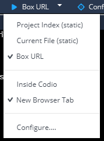

# Rails CRUD - The BasicBooks App

This lab and homework assignment are designed to get you familiar with:
+ Initializing a new Rails app
+ The structure of Rails apps
+ Creating a model
+ Creating dev data
+ How to return a simple HTML page
+ How to return data from the database
+ How to POST an HTML FORM and view the data in Rails
+ How to implement CRUD operations.
+ How to generate links using `link_to`.
+ How to deploy to production on Heroku.

## Lab and Homework

This assignment is part lab and part homework.  You are expected to work with your team at least through getting Rails up and running and committed to your repository before the end of lab.  If you finish this before the end of lab, you are welcome to continue working with your team on the homework until the end of lab.  Once lab is over, you should continue working on the homework independently.  Remember to appropriately acknowledge any assistance given or received as part of lab on your homework submission.

## Learning Web Frameworks

Rails is an industrial strength web framework.  Shopify is built with Rails.  GitHub is built with Rails.  Airbnb is on Rails.  And so forth.

With this power comes an additional does of complexity.  The complexity comes from Rails having many moving parts, and from the enforcement of the model-view-controller (MVC) design pattern.  MVC is extremely useful for managing the design of apps, but it will seem strange at first, and it will be challenging to keep track of everything that is going on.

While I will try to guide you in the most efficient manner to learning the critical bits you need to know, there is a tremendous amount of knowledge needed to become a successful engineer of web apps with a web framework.  You will need to develop an ability to turn to other books, manuals, and websites to learn what you need to know.  This is the life of a professional engineer.  The professional engineer always needs to learn more, and you must develop the ability to learn from reading and then doing.

The following book is the most helpful and is availble via the library:

1. [Learning Rails 5](https://ocul-wtl.primo.exlibrisgroup.com/permalink/01OCUL_WTL/5ob3ju/alma999986583426005162). While this is about Rail 5, and we're using Rails 6, almost everything is the same between Rails 5 and 6 at the level we will do work in MSCI 245 and 342.  In chapter 6, the book uses `form_for` rather than `form_with`, but other than their names, there is very little different between them.  Rails combined the functionality of `form_tag` and `form_for` into one new form method called `form_with`.  Certainly there are some other differences, but they are not significant to the concepts explained in the book, which are the important things to learn. The [course textbook](http://www.saasbook.info/) unfortunately is Rails 4 and is getting out of date on several details about Rails.  The textbook is good for learning conceptual knowledge, but for actually programming of Rails, refer to more recent sources.  Always be aware of which version of Rails somone is providing advice about.  

There is also important documentation that you are going to need to refer to:

1. Guide: [Active Record Basics](https://edgeguides.rubyonrails.org/active_record_basics.html)

1. Guide: [Active Record Query Interface](https://edgeguides.rubyonrails.org/active_record_querying.html)

1. Guide: [Active Record Migrations](https://edgeguides.rubyonrails.org/active_record_migrations.html), References: [Schema Definitions](https://api.rubyonrails.org/v6.0.3.2/classes/ActiveRecord/ConnectionAdapters/SchemaStatements.html) and  [table-definition (inside the do block of create_table)](https://api.rubyonrails.org/v6.0.3.2/classes/ActiveRecord/ConnectionAdapters/TableDefinition.html)

The following book is written in a tutorial style, which impedes its use as a source of information, but it is very good if you want to see step by step instructions and well written explanations:

1. [Ruby on Rails Tutorial, 6th Ed](https://ocul-wtl.primo.exlibrisgroup.com/permalink/01OCUL_WTL/1jjglgg/alma999986595715005162)

The following may be useful to you, but "Learning Rails 5" plus the Rails Guides will likely suffice:

1. [The Rails 5 Way, Fourth Ed.](https://ocul-wtl.primo.exlibrisgroup.com/permalink/01OCUL_WTL/5ob3ju/alma999986579602405162)

1. [Agile Web Development with Rails 6](https://ocul-wtl.primo.exlibrisgroup.com/permalink/01OCUL_WTL/5ob3ju/alma999986618645205162)

### Advice from fellow students

One problem with these assignments in MSCI 245, and with software tutorials in general, is that the pressure of getting work done can lead to skimming the content and trying like mad to just copy and paste code as fast as possible until the assignment is done.  

In MSCI 342, I asked students what advice they had for MSCI 245 students.  The most common piece of advice was to make sure you understand what you are doing rather than copying and pasting.  When a homework assignment shows you how to do something, you need to understand why you're doing it.  As one student said, if you robotically copy and paste, you'll come to regret not acquiring the knowledge, for it will be needed on exams, the final project, and for all of MSCI 342.

# Getting Rails up and running

You are reading these directions on Codio having cloned the repository to a directory named `basicbooks`.  First:

```
cd basicbooks
```

**STOP!** Double check that you are in a directory named `basicbooks`.  Do:
```
pwd
```
to "print working directory" and see that the path shown ends with `/basicbooks`.

*If you are not in a directory named* `basicbooks`, go back to the homework instructions and make sure you have correctly cloned the repository as shown.  Everything depends on you getting this right.  

### You are in the repository directory `basicbooks`

Now, copy and paste the following and run it from the command prompt (unless otherwise noted, these commands will always be run from the command prompt, and I won't keep reminding you where to run them).

**Warning:** This is a very long command.  Students often fail to copy the entire command, which messes stuff up.  Be sure you carefully copy the whole command.

```
rails new . --database=postgresql --skip-javascript --skip-turbolinks --skip-action-mailer --skip-action-mailbox --skip-action-text --skip-active-storage --skip-action-cable --skip-spring --skip-bundle 
```

The `rails new .` creates your new app in this directory.  This directory is called the **app root** directory for the new app.  The name of your directory is important because it will be used as the name of the app and will prefix the names of the development and test databases.

In the Codio setup for MSCI 245 and MSCI 342, we do not have a good way to test web apps built using javascript.  Thus, both `--skip-javascript` and `--skip-turbolinks` are used to disable parts of Rails that depend on javascript.  The other "skip" options are to exclude parts of Rails you are unlikely to need to use and which simply clutter up your app and make learning Rails harder. 

Then, open up the `Gemfile` and comment out the `jbuilder` and `tzinfo-data` gems.  To comment out a line, place a `#` character at the start of the line as such:

```ruby
# Build JSON APIs with ease. Read more: https://github.com/rails/jbuilder
#gem 'jbuilder', '~> 2.7'
```
and
```ruby
# Windows does not include zoneinfo files, so bundle the tzinfo-data gem
#gem 'tzinfo-data', platforms: [:mingw, :mswin, :x64_mingw, :jruby]
```

Then, in the terminal, at the command prompt:

```
 bundle install
```
This may take several minutes to run.

The command `bundle` looks at the Gemfile and downloads and installs the Ruby gems needed for your Rails app.  It places detailed dependency info into a file named Gemfile.lock.  These files capture the specific versions of the software needed to make sure your app works as you have designed and tested it.  We always keep our Gemfile and Gemfile.lock files in our git repository.  Whenever you change or add a gem to your Gemfile, you need to run `bundle install` again.

Next, add the following to `config/environments/development.rb` after "`Rails.application.configure do`":

```ruby
config.hosts << /[a-z0-9]+\-[a-z0-9]+\-3000\.codio\.io/
```

The above is needed to allow us to view our web app while in development mode on the Codio server.  Each student gets their own Codio server, which is a linux machine running in the Amazon cloud.  Unlike MSCI 240, where it might have been encouraged for you to locally develop your code on your personal computer, the environment configuration needs in MSCI 245 and 342 are so significant, that you should be doing all of your work on Codio.  Do not waste your time trying to get Rails and Postgresql to run on your personal computers.

While we will not do much with automated testing in MSCI 245, our Rails app is configured to work with [Minitest](https://github.com/seattlerb/minitest).  When we make projects in MSCI 245 and 342, we will always make the following configuration changes to make testing work better for us on Codio.

In `test/test_helper.rb` comment out:

```ruby
# parallelize(workers: :number_of_processors)
```

By commenting out `parallelize(workers: :number_of_processors)`, this will force our automated tests to run 1 at a time.  This is very handy if we want to use the byebug debugger to debug tests or see how testing works.  

In `test/test_helper.rb` also comment out:

```ruby
#fixtures :all
```

The use of fixtures, for testing, complicates our work, and we'll avoid using them.

In `test/application_system_test_case.rb`, comment out: 

```ruby
driven_by :selenium, using: :chrome, screen_size: [1400, 1400]
```

and add:

```ruby
driven_by :rack_test
```

So, you'll end up with:

```ruby
#driven_by :selenium, using: :chrome, screen_size: [1400, 1400]
driven_by :rack_test
```

The `:rack_test` driver cannot process javascript, but it runs very quickly.  The issue with using `:selenium` and Chrome as our system test driver is that I haven't been able to get these components to install correctly on Codio.  Projects in MSCI 342 should not use javascript, and so this will not be an issue.

Then create a file in the basicbooks directory named `Procfile` and put this command in the file as per the [heroku instructions](https://devcenter.heroku.com/articles/deploying-rails-applications-with-the-puma-web-server):
```
web: bundle exec puma -C config/puma.rb
```

Then do:

```
rails db:create db:migrate
```

This will create your databases.  You should see output:
```
Created database 'basicbooks_development'
Created database 'basicbooks_test'
```
You should never directly access your `basicbooks_test` database, which is used by the testing tools. 

You will and should often look at your development database.

Let's look at the development database.

To do this, we use psql, which is the command line interface to Postgresql. 

To login to our database, we do:
```
psql -d basicbooks_development
```
To see all the commands in psql, we do `\?`.  Try it.  Press the space bar to page through them all.  Press `b` if you want to scroll up.  When you get to the end, press `q`.  The key presses stand for "back" and "quit".  Memorize them.

To list the tables, enter `\d`.  You should see:

```
               List of relations
 Schema |         Name         | Type  | Owner
--------+----------------------+-------+-------
 public | ar_internal_metadata | table | codio
 public | schema_migrations    | table | codio
(2 rows)
```

These are tables used by Rails.  Don't mess them up.

To escape from psql, enter `\q`.

### Checking that your install works

Run:

```
rails server -b 0.0.0.0
```

You will see that we are using the Puma webserver and that it is running on port 3000. 

At the top of your Codio window, you will see a dropdown menu titled "Project Index (static)". Click the white downward pointing arrow and set it to be "New Browser Tab" and not "Inside Codio" and then select "Box URL". You will be transported to a new browser tab and you should see a message that says "Yay! You're on Rails!".  This is what the dropdown should look like in Codio: 



If you don't get the "Yay!" message, now is the time to figure out what you didn't do correctly above.  You can open multiple terminals in Codio.  This allows you to do work in one terminal while your server runs in the other terminal.

You can shutdown your server by typing CTRL-C.  Usually the server will pick up changes to your code automatically, but configuration changes are unlikely to be picked up.  You can always stop your server with CTRL-C and start it running again if you have any doubt.

Once you get your install working, it is time to commit all of this code to the repository:
```
git add --all
git commit -m"Yay! I am on Rails!"
git push
```
We will be checking for your "Yay" commit message, and so please use the message as per above.  

I encourage you to go and check out your repository in GitHub, but please **never** directly edit any of your files via GitHub.  Please always edit them via your repository in Codio.  (If you do edit in GitHub, usually the correct fix is to do a `git pull` from Codio, but please, let's avoid the issue all together.)

### End of Lab

Everyone is expected to have made it to here before the end of lab.

## Before proceeding

If you are not caught up on the course lectures, you should go watch them first before doing more of the homework.  The lectures cover the concepts that you are going to be putting into practice in the homework.  

## Our BasicBooks App

Our BasicBooks App is going to be very basic.  It will allow us to view books in the database, and to experiment with POSTing data.

Well, we know that Rails apps are based on the MVC pattern (Model, View, Controller), and so it seems pretty sensible to figure out what the model(s), view(s), and controller(s) are going to be.  As you'll see as we go through this, we don't do them separately except for the model.  It works best for us to go back and forth between the controller and the views as we build the app.  This let's us test it as we progress in getting it up and running.  When we do development, we want to follow this process:

1. Write a bit of code or make a small change to the app.

1. Check that the app still works and/or does what we expect the new code to do.  If the app is broken or buggy, work on the app to fix it.  Do not add more functionality or other changes until you are back to a working app.  If the app is working, go to step 1 and add some more code.

### Model Making

Our app is going to have a very simple schema.  We will have a single entity set: books.  Each book has a title, an author, and our personal rating from 1 to 5.  This app is our personal app for keeping tracking of books and our opinion of them.  

We can ask Rails to generate a model for us.  When we ask for a model, we use the form of the entity name in CamelCase, i.e. Book not books.  

To make the model do:

```
rails generate model Book title:string author:string rating:integer
```
You'll get the following output:
```
      invoke  active_record
      create    db/migrate/20210625040017_create_books.rb
      create    app/models/book.rb
      invoke    test_unit
      create      test/models/book_test.rb
      create      test/fixtures/books.yml
```
You can ignore the files created in the `test` directory.  You will have a different number in front of your _create_books.rb file.  That number is a timestamp.

What you've done is make a "migration". This is a ruby script for making changes to the database. The beauty of this is that all of our work on the database is recorded in scripts that can be replayed to build a system exactly the same way on other machine, for example in our deploy version in the cloud on Heroku.

The migration can be found in `db/migrate/` in the specific file output in your terminal. Go open that file, and you will see:

```ruby
class CreateBooks < ActiveRecord::Migration[6.1]
  def change
    create_table :books do |t|
      t.string :title
      t.string :author
      t.integer :rating

      t.timestamps
    end
  end
end
```

Who needs stinkin' SQL DDL?  Even though you don't know the syntax above, you should be able to recognize that this is very similar to creating tables in SQL.  We didn't ask for a `t.timestamps` column, but Rails is going to use this to make some columns that it needs.

In addition to the migration, we also got our model created in `app/models/book.rb`.  If you open that file, you'll see:

```ruby
class Book < ApplicationRecord
end
```

Which is pretty simple.  The `Book` class inherits from ApplicationRecord. Read all about [ActiveRecord and ApplicationRecord](https://guides.rubyonrails.org/active_record_basics.html).

While we've made a migration, we haven't used it yet to change the database.  To add the table to the database, do:
```
rails db:migrate
```
which runs all migrations not yet run.  You will see a message saying that `create_table(:books)` was run.

Let's go and look into the database and see what happened:
```
psql -d basicbooks_development
```
The in psql, type `\d` to see the tables:
```
basicbooks_development=# \d
                List of relations
 Schema |         Name         |   Type   | Owner 
--------+----------------------+----------+-------
 public | ar_internal_metadata | table    | codio
 public | books                | table    | codio
 public | books_id_seq         | sequence | codio
 public | schema_migrations    | table    | codio
(4 rows)
```
Cool, eh?  We now have a books table and a books_id_seq sequence.  In postgresql, sequences are used to maintain a record of unique ids.  Don't mess with books_id_seq.

To describe the books table, enter `\d books`:
```
                                          Table "public.books"
   Column   |              Type              | Collation | Nullable |              Default              
------------+--------------------------------+-----------+----------+-----------------------------------
 id         | bigint                         |           | not null | nextval('books_id_seq'::regclass)
 title      | character varying              |           |          | 
 author     | character varying              |           |          | 
 rating     | integer                        |           |          | 
 created_at | timestamp(6) without time zone |           | not null | 
 updated_at | timestamp(6) without time zone |           | not null | 
Indexes:
    "books_pkey" PRIMARY KEY, btree (id)
```
We see that our Book model (singular Book) produces an entities table books (plural).  This is a Rails convention, and it is really nice.  The Book model will represent a row in the table, i.e. a single book.  The table, is a collection of entities, and thus it is named `books`.   You can also see how Rails by default gives each entity a unique id name `id`.  There are time extra columns in here that Rails needs: created_at and updated_at.  We don't ever directly manipulate these columns.  Also, we can see that Rail went ahead and put an index on our primary key (the `id` attribute).

Press `q` to exit the display of the table.

Enter `\q` to exit psql.

Now that we checked out our model in the database, we realize that the table allows the title, author, and rating fields to be null.  We want to set these columns to be `not null`.

When we run `rails db:migrate` and realize that we didn't mean to actually do the migration, we can undo the operation with `rails db:rollback`.  Do that now:
```
rails db:rollback
```
You should see a message telling you that you've reverted the "CreateBooks" migration and that it has dropped the books table.

Let's edit the migration.  Find it in `db/migrate` and change it to be:
```ruby
class CreateBooks < ActiveRecord::Migration[6.1]
  def change
    create_table :books do |t|
      t.string :title, null: false
      t.string :author, null: false
      t.integer :rating, null: false

      t.timestamps
    end
  end
end
```
What we're doing above is supplying options to the creation of the columns.  You can see all the options in the [docs for the `add_column` method](https://api.rubyonrails.org/v6.1.3.2/classes/ActiveRecord/ConnectionAdapters/SchemaStatements.html#method-i-add_column).

Now rerun the migration:
```
rails db:migrate
```

Go into the database with `psql -d basicbooks_development` and verify that the books table now has not null constraints on the columns.

### Dev Data

It it handy for development to get some data in the database before proceeding.

Rails maintains 3 different environments: development, test, and production.  The development environment is setup for us to write code and play around with our database as needed.  We'll put data in the database in ways that help us develop the app faster.  The test environment is specially for the automated tests to use.  We do not touch the test database.  The production environment is for when we deploy our app to a server for others to use.  The only data we want to add to  the database for the production environment is the data the app would need for proper functioning.  We don't want "dev data" in our production database.  

We can achieve the goal of adding in dev data as we want, with keeping the production database clean with careful use of Ruby's database `db/seeds.rb` file.  The `seeds.rb` file is just Ruby code that is run when we execute the command `rails db:seed`.

First, edit the file to look like this:
```ruby
# This file should contain all the record creation needed to seed the database with its default values.
# The data can then be loaded with the rails db:seed command (or created alongside the database with db:setup).
#
case Rails.env
when "development"
  # add dev data here
when "production"
  # no seed data for production
end
```

The Book model, is a class that inherits all the functionality of a `ApplicationRecord` class.  This means that it has a `create` method that we can use to create new books in the database.  https://guides.rubyonrails.org/active_record_basics.html

Now, edit `db/seeds.rb` to be:

```ruby
# This file should contain all the record creation needed to seed the database with its default values.
# The data can then be loaded with the rails db:seed command (or created alongside the database with db:setup).
#
case Rails.env
when "development"
  Book.create( title: "Dune", author: "Frank Herbert", rating: 5 )
  Book.create( title: "Dandelion Wine", author: "Ray Bradbury", rating: 0 )
  Book.create( title: "The Hitchhiker's Guide to the Galaxy",
               author: "Douglas Adams", rating: 4 )
  Book.create( title: "James and the Giant Peach", author: "Roald Dahl", rating: 5 )
  Book.create( title: "Charlie and the Chocolate Factory", author: "Roald Dahl", rating: 3 )
  Book.create( title: "Matilda", author: "Roald Dahl", rating: 2 )
  Book.create( title: "The Lord Of The Rings", author: "J.R.R. Tolkien", rating: 0 )
  Book.create( title: "Ender's Game", author: "Orson Scott Card", rating: 4 )
  Book.create( title: "Dune", author: "Frank Herbert", rating: 5 )
  Book.create( title: "Slaughterhouse-Five", author: "Kurt Vonnegut", rating: 3 )
  Book.create( title: "Snow Crash", author: "Neal Stephenson", rating: 3 )
  Book.create( title: "Cryptonomicon", author: "Neal Stephenson", rating: 5 )
when "production"
  # no seed data for production
end
```

Save the file and then back in the terminal, do:

```
rails db:seed
```

to run the code.

Let's go look in psql and see that this worked:
```
psql -d basicbooks_development
```
Then we can run sql code directly from the prompt:
```
basicbooks_development=# select id, title, author, rating from books ;
 id |                title                 |      author      | rating 
----+--------------------------------------+------------------+--------
  1 | Dune                                 | Frank Herbert    |      5
  2 | Dandelion Wine                       | Ray Bradbury     |      0
  3 | The Hitchhiker's Guide to the Galaxy | Douglas Adams    |      4
  4 | James and the Giant Peach            | Roald Dahl       |      5
  5 | Charlie and the Chocolate Factory    | Roald Dahl       |      3
  6 | Matilda                              | Roald Dahl       |      2
  7 | The Lord Of The Rings                | J.R.R. Tolkien   |      0
  8 | Ender's Game                         | Orson Scott Card |      4
  9 | Dune                                 | Frank Herbert    |      5
 10 | Slaughterhouse-Five                  | Kurt Vonnegut    |      3
 11 | Snow Crash                           | Neal Stephenson  |      3
 12 | Cryptonomicon                        | Neal Stephenson  |      5
(12 rows)
```
Yay!  

Type `\q` to exit psql.

You can gain some experience with the Book model and how ActiveRecords work by using the rails console.  The rails console is just like irb, but it knows all about our Rail app automatically.

You can safely play around with the database by running rails console with the option --sandbox.  Any changes you make will be rolled back when you exit the console. Do:
```
rails console --sandbox
```
Then do:
```
Book.all.limit(2)
```
To ask the Book model for all of the books.  Notice how this is turned into SQL for you: `SELECT "books".* FROM "books" LIMIT $1  [["LIMIT", 2]]`.

To find the book with an id of 1, do:
```
Book.find(1)
```
You'll see that the method runs the SQL command: `SELECT "books".* FROM "books" WHERE "books"."id" = $1 LIMIT $2  [["id", 1], ["LIMIT", 1]]`.  

To print out all book titles, do:
```
Book.find_each { |b| puts b.title }
```
To delete the book with id=1, do:
```
Book.destroy(1)
```
and then list the books again to verify it is gone:
```
Book.find_each { |b| puts b.title }
```
Type `quit` to exit the console.

## RESTful routes for books

If you haven't done it recently, now is a good time to commit your repo and push to GitHub.  This gives you a backup in case of disaster.

You can see the routes for our app by doing:
```
rails routes
```
As you can see, we are lacking in the routes department.  For our app to do anything, we need routes that a user can go to, which are then handled by our controller (to be made), which then renders our views (also to be made).

Routes are kept in `config/routes.rb`.  Open the file up.

Right now it is pretty sparse:
```ruby
Rails.application.routes.draw do
  # For details on the DSL available within this file, see https://guides.rubyonrails.org/routing.html
end
```

When we have an entity like books, Rails calls them a **resource**.  Rails provide a shortcut for making routes for resources.  After the `do`, and before the `end` in the `routes.rb` file, add:
```
resources :books
```
Save the file, and then run:
```
rails routes
```
We'll now have lots of routes:
```
   Prefix Verb   URI Pattern               Controller#Action
    books GET    /books(.:format)          books#index
          POST   /books(.:format)          books#create
 new_book GET    /books/new(.:format)      books#new
edit_book GET    /books/:id/edit(.:format) books#edit
     book GET    /books/:id(.:format)      books#show
          PATCH  /books/:id(.:format)      books#update
          PUT    /books/:id(.:format)      books#update
          DELETE /books/:id(.:format)      books#destroy
```
These are all important.  The GET /books route says it is handled by the books controller's index action.  It is considered the "default" handler, in that it is run when a user requests /books.  Usually, we have the index provide an overview of the resource, and often provide a list of the items.  For us, that would be a list of the books in the database.

Notice the routes that include an ":id".  For example GET books/1 will be a request to show the book with id=1.  You can ignore the "(.:format)" in these routes.

The "Prefix" means that Rails will make available in the controller, and the view, special helper methods that will return the path for the route.  For example there will be `books_path` and it will return "/books" and `new_book_path` will return "/books/new".  It is much better practice to call these helper methods rather than type the path directly.  In addition to these "_path" methods, there are also made "_url" methods, for example: books_url, new_book_url, etc.  These return the full url to the web page, for example: https://lola-concert-3000.codio.io/books .  We'll most often use the "_path" methods to produce relative paths.  The "_url" methods are used when we need to do a "redirect" in the controller.

# A controller and views for books

We can ask Rails to make us a controller with the actions we need.  For a resource controller, we also use the plural form of the resource.  Do:
```
rails generate controller books index create new edit show update destroy --skip-routes
```
This gives us lots of good stuff:
```
      create  app/controllers/books_controller.rb
      invoke  erb
      create    app/views/books
      create    app/views/books/index.html.erb
      create    app/views/books/create.html.erb
      create    app/views/books/new.html.erb
      create    app/views/books/edit.html.erb
      create    app/views/books/show.html.erb
      create    app/views/books/update.html.erb
      create    app/views/books/destroy.html.erb
      invoke  test_unit
      create    test/controllers/books_controller_test.rb
      invoke  helper
      create    app/helpers/books_helper.rb
      invoke    test_unit
      invoke  assets
      invoke    scss
      create      app/assets/stylesheets/books.scss
```      
Each "create" above is a new file that has been created.  We now have a controller in `app/controllers/books_controller.rb` and we have views in `app/views` made for each of the controller's actions.  There is even more, but we can ignore this other stuff for now.

Take a look at `books_controller.rb`.  You'll see in it a class that inherits from ApplicationController and has empty methods for each of the actions we requested when we generated the controller.

Edit your controller to look like this:
```ruby
class BooksController < ApplicationController
  def index
    byebug
  end

  def create
    byebug
  end

  def new
  end

  def edit
  end

  def show
  end

  def update
  end

  def destroy
  end
end
```
We've added `byebug` to the index and create methods.  Recall that we have these routes defined that are for `/books`:
```
   Prefix Verb   URI Pattern               Controller#Action
    books GET    /books(.:format)          books#index
          POST   /books(.:format)          books#create
etc.
```
The routing decides which code to call depending on the HTTP request "Verb" and the URI Pattern.  If there is a GET request for `/books`, then the we will run the code in the `index` method of BooksController.  If it is a POST request fo the same path of `/books`, then we'll call the `create` method of the BooksController.  

Lets run the webserver and request `/books` in the browser, and see where the debugger stops us.  Do:
```
rails server -b 0.0.0.0
```
Use the Codio menu and to to the "Box URL".

Now, you will see you are at a url like "https://lola-concert-3000.codio.io/" but with a different hostname.  Append to the browser's url "/books" and hit the enter key.

The browser will sit there and spin.  Go back to Codio.

In the terminal where you started the server, you will see that you've dropped into the debugger!  This is so, so, cool.  

In Rails, you can place a `byebug` just about anywhere and debug what is going on with your code.  You can put `byebug` into any view, model, or controller.  This is a super powerful technique for debugging and just trying to figure out what Rails does.

You should see that we're in the `index` method:
```
[1, 10] in /home/codio/workspace/basicbooks/app/controllers/books_controller.rb
    1: class BooksController < ApplicationController
    2:   def index
    3:     byebug
=>  4:   end
    5: 
    6:   def create
    7:     byebug
    8:   end
    9: 
   10:   def new
(byebug) 
```

So, this tells us that when we request a URL with our web browser, the default is a GET request.  We will use HTML forms to generate POST requests.  

To exit the debugger, just type "continue".

Remove the byebug's from BooksController.

If you've stopped your webserver, start it back up again, and go to `/books` again.

You'll see a page that says:
```
Books#index

Find me in app/views/books/index.html.erb
```

Go open up `app/views/books/index.html.erb`:
```html
<h1>Books#index</h1>
<p>Find me in app/views/books/index.html.erb</p>
```
and we see the html that got displayed.  

Rails pairs up a view by default with controller actions (methods).  The BooksController's `index` method by default will "render" the view in `app/views/books/index.html.erb` at the end of the `index` method.  Likewise the BooksController's `create` method is going to render the view `app/views/books/create.html.erb` once the `create` method has exited.  

Okay, let's work on our controller.  Open up `app/controllers/books_controller.rb`.

We said that the index view should produce a list of books.  Remember that the controller mediates between the model and the view.  So, in the index action handler, we should ask the Book model for all of the entries and put them in an instance variable for the view to use:
```ruby
  def index
      @books = Book.all
  end
```
Remember that the default view to render at the end of an action is the view with the same name as the action.  So, open up `app/views/books/index.html.erb` and change it to loop through the books and display their titles:
```html
<h1>Books</h1>
<ul>
<% @books.each do |book| %>
  <li><%= book.title %></li>
<% end %>
</ul>
```
The above file is an [ERB template](https://guides.rubyonrails.org/action_view_overview.html#templates). ERB allows us to run ruby code between the `<% %>` and `<%= %>` tags.  Whatever is not inside these tags is simply printed out as the output of the view.  The `<% %>` tags are used for code that should not have its value printed out.  The `<%= %>` tags run the code inside them and then print out the value of the result.  Note that "puts" and "print" do not work in ERB.

The view has access to the `@books` instance variable we made in the controller.  Then we use a simple loop intermixed with simple html to make our list.

Go to /books on the website and see that it works.

For the 'show' action, recall that the route will be /books/id where id is a number.  Rails will grab the number and put it in the params hash with the key `:id`.  Let's see if this is true.

In the controller, put the following in the show action handler:
```
  def show
      byebug
  end
```
Now, you should still have a terminal with the puma webserver running.  After you go to /books/42 in the browser, go back to that terminal, and you should see:
```
Processing by BooksController#show as HTML
  Parameters: {"id"=>"42"}
Return value is: nil

[12, 21] in /home/codio/workspace/basicbooks/app/controllers/books_controller.rb
   12:   def edit
   13:   end
   14: 
   15:   def show
   16:     byebug
=> 17:   end
   18: 
   19:   def update
   20:   end
   21: 
(byebug) 
```
and we've been dropped into byebug.  To see what is in `params`, type `params` at the byebug prompt:
```
(byebug) params
#<ActionController::Parameters {"controller"=>"books", "action"=>"show", "id"=>"42"} permitted: false>
```
So, we see that it knows the controller is books, and the action is show, and id has been set to 42.  Try typing `params[:id]` and `params["id"]
```
(byebug) params[:id]
"42"
(byebug) params["id"]
"42"
```
These ruby symbols, e.g. :id, behave like immutable strings for hashes in Rails.  So, :id and "id" work the same as a key for the params hash.  Ruby convention is to use the symbols, e.g. `:id`.

Now, type `continue` to let the server finish processing the request.

As mentioned before, being able to debug in this fashion is super powerful.  

Okay, back to the show action and show view.  In the controller, let's get the book requested:
```ruby
def show
      @book = Book.find params[:id] 
end
```
and in the view (app/views/books/show.html.erb), we'll show this book:
```erb
<h1>Book with id = <%= @book.id %></h1>
<table>
    <tr><td>Title:</td><td><%= @book.title %></td></tr>
    <tr><td>Author:</td><td><%= @book.author %></td></tr>
    <tr><td>Rating:</td><td><%= @book.rating %></td></tr>
</table>
```
Try it out by going to /books/1 , /books/2, etc. in your browser.

### New and Create

The BooksController#new method will cause the app/views/books/new.html.erb view to be rendered.  This view's job is to provide an HTML FORM that we can fill out to add a new book to the database.

In Rails, we need to use the tools Rails provides for creating forms, or we'll have problems.  We do **not** hack out our own HTML forms.  By using the Rails tools, we gain all sorts of security protections that Rails has already figured out.

To create a form, we use the following code in our `app/views/books/new.html.erb` file:
```erb
<h1>Add a Book to the DB</h1>

<%= form_with( model: @book, local: true) do |form| %>
    <!-- Insert into here the form buttons, etc.  We'll get to these in a moment. -->
<% end %>
```
The `<h1></h1>` tags are an HTML heading. The `<%= %>` tags run some ruby code and print out the value returned.  The `<% %>` tag without the equals sign, just lets us have ruby code without any output, and that is why the "end" statement is inside `<% %>`.

The code we're running here is the "form_with" method.  We're passing it a value for the  parameter "model:", and the value is `@book`.  What is this `@book`?  The `@` symbol tells us it is an instance variable, which means it must be from the BooksController.  When creating a new book, we supply the `form_with` a model object that **has not yet been saved to the database**.  Rails then uses its knowledge of the model, its name, and the routes in `routes.rb` to know that this form should be submitted (POSTed) to `/books`. 

The `local: true` option disables use of AJAX for submitting the form.  We will always use `local: true` because we are creating web apps without javascript.  If you forget to use `local: true`, you'll break automated testing.

Go ahead and edit your new.html.erb view to look like the above.  

We need to create the `@model` object in the BooksController's new method.  Edit the BookController's `new` method to look like:
```ruby
  def new
    @book = Book.new
  end
```

Then, be sure your webserver is running and go to `/books/new` in your web browser.  All you should see is "Add a Book to the DB" on the screen.  Didn't our code work?

To see the HTML that what was actually produced by our view, right click in the window and select "View Page Source".

You can see that there is a lot that Rails is producing for such a simple page!

Views in Rails are at least a two step process.  First, the ERB code in `app/views/layouts/application.html.erb` is run:
```erb
<!DOCTYPE html>
<html>
  <head>
    <title>Basicbooks</title>
    <meta name="viewport" content="width=device-width,initial-scale=1">
    <%= csrf_meta_tags %>
    <%= csp_meta_tag %>

    <%= stylesheet_link_tag 'application', media: 'all' %>
  </head>

  <body>
    <%= yield %>
  </body>
</html>
```
In the above code, is the template for which all of our views use in our application.  The ERB code in our books' views are run at the point where the above code calls `yield`:
```erb
  <body>
    <%= yield %>
  </body>
```
Thus, all of our views render themselves into the HTML body of the web page.  If you want to change the look of every page in your app, editing the application.html.erb page is one way to do it.  

Go ahead and edit your application.html.erb page to give your app a title on every page of "Your Name's BasicBooks App".  For example, I'd edit mine to be "Mark Smucker's BasicBooks App".

Alright, so lets go back to looking at the HTML produced by our new.html.erb view.  Our `form_with` is producing the following HTML:
```html
<form action="/books" accept-charset="UTF-8" method="post"><input type="hidden" name="authenticity_token" value="q_LGNzt5W9Tu8GeI910AGpcJ8eVgB2QPAzyT6ZXTjf7qEMgkgnSKtWB6Gtc93aBMi_RWayql4JQ44sjKh0105w" />
</form>
```
We can see the form will POST to "/books".  The "authenticity_token" is to avoid hacks.  When we use Rails properly, we get leading edge website security features.  Do not hack up your own html forms!

Okay, so we need to add some input fields to our form and a submit button.

We can read about how to add these elements, known as tag helpers, in the [ActionView::Helpers::FormHelper manual page](https://api.rubyonrails.org/classes/ActionView/Helpers/FormHelper.html).  If you read this (you should), you'll see we can add text_field, number_field, and a submit as follows to our new.html.erb view:

```erb
<h1>Add a Book to the DB</h1>

<%= form_with(model: @book, local: true) do |form| %>
  <div>
    <%= form.label :title %>
    <%= form.text_field :title %>
  </div>

  <div>
    <%= form.label :author %>
    <%= form.text_field :author %>
  </div>

  <div>
    <%= form.label :rating %>
    <%= form.number_field :rating %>
  </div>

  <div>
    <%= form.submit %>
  </div>
<% end %>
```
We match the label and fields with names that match the attributes of the model, e.g. title, author, and rating.  None of this is our choice if we want Rails to work smoothly.  Go with the flow, and do it the Rails way.

Make the above changes and then get `/books/new` again in your browser and view the html.

Most importantly, notice the input tags:
```html
    <input type="text" name="book[title]" id="book_title" />
```

```html
   <input type="text" name="book[author]" id="book_author" />
```

```html
    <input type="number" name="book[rating]" id="book_rating" />
```
The `name` for each one is of the form `book[attribute]` where attribute is replaced with title, author, and rating.  While the name is just a string in HTML, Rails has choosen to make this string look like a Ruby hash.

Okay, in your BooksController, add `byebug` to the `create` method:
```ruby
  def create
    byebug
  end
```
Then, fill out the form on the /books/new page in your browser with a title of "Animal Farm", author "George Orwell", and rating "3".  Submit the form.  Go back to Codio and you should be in the debugger:
```
Processing by BooksController#create as HTML
  Parameters: {"authenticity_token"=>"[FILTERED]", "book"=>{"title"=>"Animal Farm", "author"=>"George Orwell", "rating"=>"3"}, "commit"=>"Create Book"}
Return value is: nil

[3, 12] in /home/codio/workspace/basicbooks/app/controllers/books_controller.rb
    3:     @books = Book.all
    4:   end
    5: 
    6:   def create
    7:     byebug
=>  8:   end
    9: 
   10:   def new
   11:     @book = Book.new
   12:   end
(byebug) 
```
In byebug, enter `params` to view the contents of the params variable.

The params variable is of type `ActionController::Parameters` and is displayed to us as a hash.  The keys and values of the hash are:

+ authenticity_token" =>  some super long string
+ "book"=>{"title"=>"Animal Farm", "author"=>"George Orwell", "rating"=>"3"}
+ "commit"=>"Create Book", 
+ "controller"=>"books", 
+ "action"=>"create"

Of interest to us is that one of these key value pairs is another hash named `books`:

+ "title"=>"Animal Farm"
+ "author"=>"George Orwell"
+ "rating"=>"3"

We can gain access these values as follows (do this in the debugger):
```
(byebug) book_params = params.require(:book).permit(:title, :author, :rating)
#<ActionController::Parameters {"title"=>"Animal Farm", "author"=>"George Orwell", "rating"=>"3"} permitted: true>
(byebug) book_params[:title]
"Animal Farm"
(byebug) book_params[:author]
"George Orwell"
(byebug) book_params[:rating]
"3"
```
We use the `params.require(:book).permit(:title, :author, :rating)` call to say "we must have a `:book` key and the only permitted parameters for it are title, author, and rating.  This is a way for us to avoid people trying to hack us by posting invalid forms to our web app.

To exit the debugger, type continue.

Now that we know how to access the parameters POSTed to us, we can write the create method:
```ruby
  def create
    book_params = params.require(:book).permit(:title, :author, :rating)
    @book = Book.new(book_params)

    if @book.save
      redirect_to @book, notice: 'Book was successfully created.'
      return
    else
      render :new
    end
  end
```
Be sure to edit the existing create method and not just cut and paste in a new one!

Now go to your browser, go to `/books/new` and submit the form with your Animal Farm data and see what happens.

Cool, eh?

There is actually quite a lot going on in the `create` method.  

Because we used the code `params.require(:book).permit(:title, :author, :rating)` to carefully make sure only authorized parameters were passed to the `book_params` variable, we can pass the whole `book_params` to `Book.new` to set the `title:`, `author:`, and `rating:` values of the book object that we initialize.  If you don't do this, you need to pass in these parameters individually.  It is a best security practice to always do the `params.require` and `permit` code.

If we are able to successfully save the book to the database (`if @book.save`) then we send a `redirect` back to the user's browser and set the `flash[:notice]` hash value to 'Book was succcessfully created.'  If we cannot save to the DB, then we `render` the `new` view.

A redirect is a special HTTP response that we can send back to the user's browser instead of HTML.  The redirect tells the user's browser "please go to this URL".  This happens seamlessly and the user never knows that they've been "redirected".  When the user is redirected, their browser does a HTTP GET of the given url.

Some usage notes about redirect_to:

+ In Rails, views are tied to the controller and have the same name as the action and are automatically rendered at the end of the action unless there has been another call to `render` or `redirect_to`.  Note that execution of the action method [does not stop after a call to render or redirect_to](https://guides.rubyonrails.org/layouts_and_rendering.html#using-render).  These methods merely work on building the response to the browser.  Thus, this is why we must have a `return` after the `redirect_to`, because otherwise we will still attempt to render a view for the `create` action, which makes no sense.  

+ When we do a redirect, we should supply a full url, e.g. http://www.example.com/books and not merely a relative path such as /books. Thus, if you need to `redirect_to` a location, use the `_url` helpers rather than the `_path` helpers.  For example, do `redirect_to books_url` rather than `redirect_to books_path`.  

#### Why we redirect
In `create` you will see that on successfully saving to the DB, we `redirect_to` another page, and in when failure occurs, we use `render` to display a template.  While we haven't written the `update` and `destroy` methods yet in the BookController, we will also use a `redirect_to` after successfully changing the database. All of these actions (create, update, destroy) are designed to modify the database and change the state of the app.  If successful and we stay on the same page, the user could hit refresh in their browser and be prompted to submit the POST request again.  This could cause problems, especially for situations such as placing orders in a commerce app, or debiting an account in an banking app.  With the `redirect_to`, the user will already have done a new request to a benign read only route, and a refresh causes no harm.  This [stackoverflow post about render vs. redirect](https://stackoverflow.com/questions/7493767/are-redirect-to-and-render-exchangeable) is a good read to explain this issue.

#### Rails magic and path/url helpers again

This code: 

```ruby
redirect_to @book
```

seems mysterious.  How in the world does `redirect_to` know what to do?  Short answer is that with RESTful routes and following the naming conventions, rails can figure out that if @book has an id of 6, than it should redirect to a url with /books/6 .  If this bothers you (it kinda bothers me), you can always call `book_url(@book)`, which at least shows that we're using a method that we know should produce a url to /books/id where the id will come from the Book object we pass in to the method `book_url`.

You can get access to the helper methods produced by your routes in the `rails console` by using the `app` object. For example:

```
codio@lola-concert:~/workspace/basicbooks$ rails console
Loading development environment (Rails 6.1.4)
3.0.1 :001 > b = Book.first
  Book Load (0.2ms)  SELECT "books".* FROM "books" ORDER BY "books"."id" ASC LIMIT $1  [["LIMIT", 1]]
 => 
#<Book:0x00005581d5c06988
... 
3.0.1 :002 > app.book_path(b)
 => "/books/1" 
3.0.1 :003 > app.book_url(b)
 => "http://www.example.com/books/1" 
3.0.1 :004 > 
```

So you can at least play with these helper methods to see how they work. 

### Understanding render and flash

Okay, so that explains the `redirect_to`, but we still need to talk about the `flash[:notice]` and the `render :new`.

The [documentation for redirect_to](https://api.rubyonrails.org/classes/ActionController/Redirecting.html#method-i-redirect_to) explains that a `notice:` argument will set `flash[:notice]` to the string you provide.

What is the `flash` hash?  The [flash (click to read docs)](https://api.rubyonrails.org/classes/ActionDispatch/Flash.html) is a special hash that allows you to record a string and have it made available to you on the *next* request that a user makes to your app.  Thus, when we redirect the user, they make another request with their browser for the given url and then we'll have anything we stuffed in the `flash` hash available to us.  On the user's next request, the `flash` will be emptied out, unless we've put new values into it.  

If you go to `/books/new` and create a new book, you will notice that there is no message shown telling us the method was successful.  The lack of the message is because we haven't put any code into our views to display the flash message.

An easy way to handle flash messages, is to put some code into our application's layout view.  

Edit `app/views/layouts/application.html.erb` to have inside the html `<body></body>` this code:

 ```erb
  <body>
    <%# Modified from: https://stackoverflow.com/questions/9390778/best-practice-method-of-displaying-flash-messages %>
    
    <% flash.each do |key, value| %>
      <%= content_tag :div, value, id: "#{key}" %>
    <% end %>      
      
    <%= yield %>
  </body>
 ```
Now our app mechanism will always display flash messages on any page.

Go to `/books/new` and create a new book and verify that it works.

### Some CSS

It'd be nice if these messages were formatted nicer.  Edit `app/assets/stylesheets/application.css` to have in it after the comments:
```css
#notice {
  color: green; 
  border: 2px solid green; 
  width: fit-content;
  padding: 7px ; }

#alert {
  border: 2px solid red; 
  width: fit-content;
  padding: 7px ; }
```

Now, any `flash[:notice]` or `flash[:alert]` messages will standout better.

Go make another book at `/books/new` to verify that it works.

As the comments in `application.css` explain, you can put CSS in this file to have it available to your whole app.

If you haven't done it recently, commit and push your code to GitHub to back it up.

## Where we're at

Okay, so this has been a lot of material to cover.  So far, we've seen how to:

+ How to setup a new Rails app from scratch.
+ Create a model
+ Create dev data and load it into the database
+ How to make the default set of routes for a resource
+ How to generate a controller
+ How to send data from the controller to the view via an instance variable
+ How to code up a basic version of creating a new instance of a model and save it to the database. This includes the concept of only permitting a specific set of params to be permitted, and how to use `form_with` and a model to generate the proper HTML form in the view.
+ Read messages from the `flash` hash.  (Setting them is simple: `flash[:notice] = "This is a notice"`, for example).
+ How to modify our app's layout to affect all pages of the up.

In other words, we've handled the C and R of CRUD, and now we shall tackle the U and D.

## Update

Updating an existing model instance is very similar to creating a new model instance.

Like creating a new intance, editing is a two step process.  First, the user send a GET request to `/books/id/edit` where `id` is replace with the numeric id of the book in the DB.  Our response to this GET request is to return an HTML form filled out with the current instance so that they can edit it.

While this could be tedious, Rails makes it quite simple for us.

Let's start with our view for the edit action.  Edit the `app/views/books/edit.html.erb` view to be:
```erb
<h1>Edit an existing Book</h1>

<%= form_with(model: @book, local: true) do |form| %>
  <div>
    <%= form.label :title %>
    <%= form.text_field :title %>
  </div>

  <div>
    <%= form.label :author %>
    <%= form.text_field :author %>
  </div>

  <div>
    <%= form.label :rating %>
    <%= form.number_field :rating %>
  </div>

  <div>
    <%= form.submit %>
  </div>
<% end %>
```
Compare this view to the new.html.erb view.  What do you see?

Well, you'll see the `form_with` is identical in both views.  In a future homework, we'll show the use of "partials" to save us from duplicating work across views.

How can the same code work for creating a new book and editting an existing book?  In each case we pass in a book via @book.  For creating a book, the @book has never been persisted to the DB.  For editing a book, the @book will be an object that we've fetch from the DB and it will know it has previously been persisted.

Okay, so we need to fix up our books controller:
```ruby
  def edit
    @book = Book.find params[:id]
  end
```
Recall that the route is `/books/:id/edit` and Rails will send us the value in the route for :id as params[:id].  So, this code fetches the book from the database, and then renders the `edit.html.erb` view.  (Reminder: Don't just copy and paste this code.  You need to edit the existing `edit` method. Ruby will let you have two methods with the same name in a class.  Don't do that.)

Okay, go to `/books/1/edit` in your browser and see what you see.  You should see the form populated with the values for the book with id=1.  If you do not, be sure you've saved your controller code.

View the source code in the browser (right click and select "View page source").

You'll see the HTML form is like:
```html
<form action="/books/1" accept-charset="UTF-8" method="post">
<input type="hidden" name="_method" value="patch" />
```
As mentioned in lecture, HTML does not allow us to send a PATCH request, but Rails has included a bit of code to tells Rails that this POST to `/books/1` is really a PATCH.

Okay, here is the code to handle the PATCH request in the controller:

```ruby
  def update
    @book = Book.find params[:id]
    book_params = params.require(:book).permit(:title, :author, :rating)
    if @book.update(book_params)
      redirect_to @book, notice: 'Book was successfully updated.'
      return
    else
      render :edit
    end
  end
```

Go to your web browswer and to `/books/1/edit` and see if you can edit it.  Try out some other ids, too.

Don't forget to commit your code frequently.

## Destroy

When we receive a DELETE http request to a path like `/books/1`, it tells us the user wants to delete the book with id=1.  Our route for this is (`rails routes` to see routes):
```
   Prefix Verb   URI Pattern               Controller#Action
          DELETE /books/:id(.:format)      books#destroy
```
So, we should get what to do:
+ In BooksController#destroy, get the book with `params[:id]` from the database, and then destroy it.
+ After destroying the book, we must `redirect_to` another page to avoid the user accidentally request to delete the book more than once.  

Okay, so here is our code for the controller:
```ruby
  def destroy
    @book = Book.find params[:id]
    @book.destroy
    redirect_to books_url, notice: 'Book was successfully destroyed.'
  end
```

How can we test this out?  We need to modify our app to let us select a book for deletion.  We'll do this by modifying the `index.html.erb` view that lists all of the books.

```erb
<h1>Books</h1>
<table>
  <thead>
    <tr>
      <th>Title</th>
      <th colspan=3></th>
    </tr>
  </thead>
  <tbody>
    <% @books.each do |book| %>
      <tr>
         <td><%= book.title %></td>
         <td><%= form_with model: book, local: true, method: 'delete' do |f| %>
                 <%= f.submit "Delete" %>     
             <% end %></td>
      </tr>
    <% end %>
  </tbody>
</table>
```
In the above, we've also moved to a table layout to make everything look nicer. 

You can see that we again have used `form_with` a model, but we've specified here that the `method` of the form should be a `delete`.  Rails knows what to do and will generate a form that POSTs to the correct path for deleting a book and will include the correct information such that it is interpretted as a DELETE for the purposes of routing the request.

Update your index.html.erb view and try deleting some of your books in the browser by going to `/books`.

## Links

Our app is missing some helpful links.  For example, it would be very nice to be able to click on the title of a book to see its details.

Rails has a method [`link_to` (click for docs)](https://api.rubyonrails.org/classes/ActionView/Helpers/UrlHelper.html#method-i-link_to) that is very helpful for creating links.  

The general form is to give it the text to display and then the path to link to.  For example, we can modify the index.html.erb view by changing:
```erb
         <td><%= book.title %></td>
```
to
```erb
         <td><%= link_to book.title, book_path(book) %></td>
```         
where `book_path(book)` is again another use of these helper methods discussed previously.

When you have it working, be sure to git commit and push again.

## Homepage

In the [Ruby on Rails Tutorial, 6th Edition](https://ocul-wtl.primo.exlibrisgroup.com/permalink/01OCUL_WTL/1jjglgg/alma999986595715005162) in section 3.2.1, the author outlines how to generate a contoller for a homepage, which I base the following instruction on.

Generate a StaticPages controller:
```
rails generate controller StaticPages home --skip-routes
```

In your `config/routes.rb` file, add this route:

```ruby
root to: 'static_pages#home'
```

This says that '/' should go to the static_pages controller and run the `home` action.  

Now you can edit the `app/views/static_pages/home.html.erb` view to add links, etc. to the various parts of your app.

If you click on your "Box URL" and go to `/`, you should see the default content for your view rather than the "Yay! I'm on Rails" page.

# Tasks

The app still needs some finishing touches.  Complete the following tasks:

1. Using ERB and the `link_to` and path "helper methods" such as `books_path` create a simple homepage for your app that has "BasicBooks" in a nice `<h1>` heading, has your name displayed, and has a link to the list of books (`/books`).

2. At the bottom of the `/books` page, provide a link back to 'Home' (`/`).

3. At the bottom of the `/books` page, provide a link to 'Add a Book' (`/books/new`).

3. At the bottom of the "show book" page (`/books/id`), provide links to Home (`/`) and the list of books (`/books`).

4. As part of the display of books at `/books`, also display the author and rating in the table.

5. On the "show book" page (`/books/id`), provide a link to "Edit this book" that links to `/books/id/edit` for that book.

6. Change the order of the books in the `/books` page to be in alphabetical order by title.  Hint: You should change Book.all in the BooksController to order the books by title.  See the guide to [ActiveRecord Querying](https://edgeguides.rubyonrails.org/active_record_querying.html#ordering).

7. Change the "Delete" functionality as follows
   + Remove the buttons to delete books from the `/books` page.
   + Add a link to the bottom of the "show book" (`/books/id`) page that links to a new page.  The link should say "Delete Book".
   + On the new page (where the "Delete Book" link takes the user for the book), provide text that asks if the user wants to delete the book, and then has a "Delete" button that will delete the book.  This page should have a link with text "Cancel Delete" that takes the user back the the `/books/id` page for that book.  
   + For example, if I was on the page `/books/1` for the book "Dune", at the bottom of that page would be a link with text "Delete Book".  When I click on the link, I would be on a new page, that asks me if I really want to delete "Dune".  If I click the "Delete" button, then "Dune" is deleted.  If I click instead on "Cancel Delete", I am taken back to the page for "Dune".
   + Hint: Both "create" and "update" actions have actions that generate a page with an HTML form that is then submitted to "create" and "update".  Why shouldn't "delete" get its own dedicated page to host the form that deletes a book? You can add a new route to the routes, for example: 
   ```ruby
   get 'books/:id/confirm_delete', to: 'books#confirm_delete', as 'confirm_delete_book'
   ```
   + You will not use a `rails generate` command, for you already have a controller to use (BooksController).  You can manually create the views file you need in `/app/views/books`.

1. Copy the format of the README.md from your previous homework and update the README.md in this repository as appropriate for this homework.

1. Git add, commit, and push all of your code to GitHub.

1. Finally, deploy your app to Heroku.  The directions for this task follow.

## Deploying to Heroku

Acknowledgement: Portions of these instructions for Heroku are copied and modified from Armando Fox's Sinatra assignment.

Heroku is a cloud platform-as-a-service (PaaS) where we can deploy our app for the whole world to use.  When we deploy our app, we are deploying the "production" version.

If you don't have an account yet, go sign up at http://www.heroku.com. You'll need your login and password for the next step.

We already have the Heroku CLI (command line interface) installed for you on Codio.

Log in to your Heroku account by typing the command: `heroku login -i` in the terminal. This will connect you to your Heroku account.

While in the root directory of your rails app (basicbooks)  type 
```
heroku apps:create basicbooks-watiamUsername
``` 
to create a new project in Heroku.  Replace "watiamUsername" with your WatIAM username.  This will tell the Heroku service to prepare for some incoming code, and locally it will add a remote git repository for you called `heroku`.  Detailed [instructions](https://devcenter.heroku.com/articles/creating-apps).

Before doing anything else, record the URL that Heroku provides telling you where to access your app on the web.

Next, make sure you stage and commit all changes locally as instructed above (i.e. `git add`, `git commit`, `git push`).

Run `git status` to verify you haven't forgotten to commit something.  We send the whole git repo to Heroku, and if you haven't committed something, it doesn't go!

Your local repo is now ready to deploy to Heroku. To deploy, push the repo to Heroku:

```
git push heroku main
```
This will build the production version of your app on Heroku.  We also need to create and migrate the database on Heroku:
```
heroku run rails db:migrate
```
We do not do `db:create` because Heroku goes ahead and creates the database for us.  If we had seed data, we would also do:
```
heroku run rails db:seed
```

The git push will have created a running instance of your app at some URL ending with `herokuapp.com`. Enter that URL in a new browser tab to see your app running live. Congratulations, you did it--your app is live on the world wide web!

Be sure to test out that your app seems to work on Heroku.  If you get a message that "We're sorry, but something went wrong. If you are the application owner check the logs for more information." then this almost always means that you forgot to run `heroku run rails db:migrate`.


